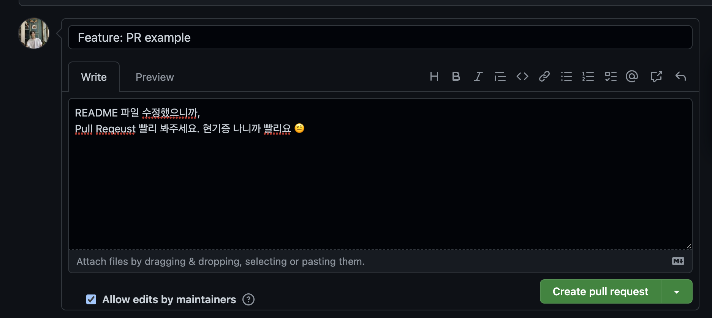
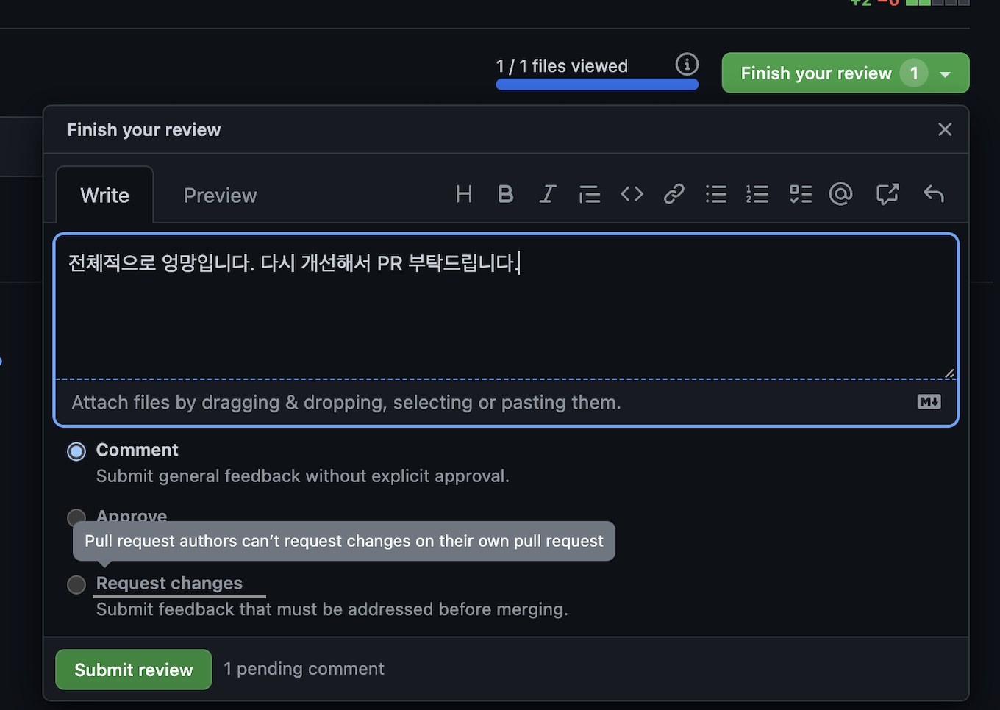
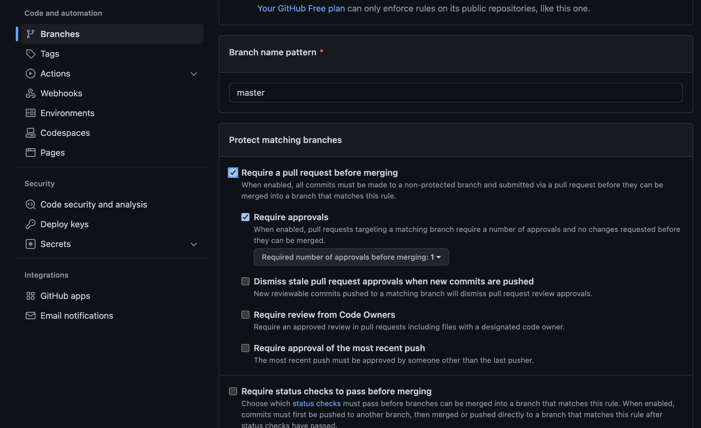

[![Contributors][contributors-shield]][owner-url]
[![Issues][issues-shield]][issues-url]
![version-shield]

  <a href=" https://blog.webudding.com/">
    
  </a>

# Pull Request Session

> 누트컴퍼니 Pull Request 학습을 위한 Session Repository 입니다.

<!-- TABLE OF CONTENTS -->
<details open="open">
  <summary><h2 style="display: inline-block">Table of Contents</h2></summary>
  <ol>
    <li>
      <a href="#pull-request">Pull Request</a>
      <!-- <ul>
        <li><a href="#built-with">Built With</a></li>
      </ul> -->
    </li>
    <li><a href="#for-what">For what</a></li>
    <li><a href="#how">How</a></li>
    <li><a href="#do-it-now">Do it now</a></li>
    <li><a href="#so">So</a></li>
  </ol>
</details>

---

## Pull Request .

> 자신의 작업 사항 (file changes)를 Merge 전에 타인( 혹은 협업자 )에게 알리고, 검토받는 일련의 과정.

---

## For What ?

- 코드 리뷰의 일종의 수단
- Push 권한이 없는 오픈 소스 프로젝트에 기여할 때
  

- master 브랜치에 Merge되기 전, 변경 사항에 대해 다른 사람들과 논의, 검토할 수 있음
  

---

## Protection

- git Branch에 일련의 규칙을 심어두어, merge 작업 등에 있어서 관리를 할 수 있게해주는 기능
  

---

## How ?

<ol>
    <li>Fork or Clone</li>
    <li>Checkout Branch</li>
    <li>Develope</li>
    <li>Commit & Push</li>
    <li>Pull Request</li>
    <li>Reviewing</li>
    <li><a href="https://im-developer.tistory.com/182">Merge</a></li>
</ol>

---

## Do it now .

```js
// 백문이 불여일견, 실습해봅시다!
```

---

## So,

>

[owner-url]: https://img.shields.io/badge/owner-1-black
[issues-url]: https://img.shields.io/badge/contributor-1-blue
[issues-shield]: https://img.shields.io/badge/contributor-1-blue
[version-shield]: https://img.shields.io/badge/contributor-1-blue
[contributors-shield]: https://img.shields.io/badge/owner-1-black
